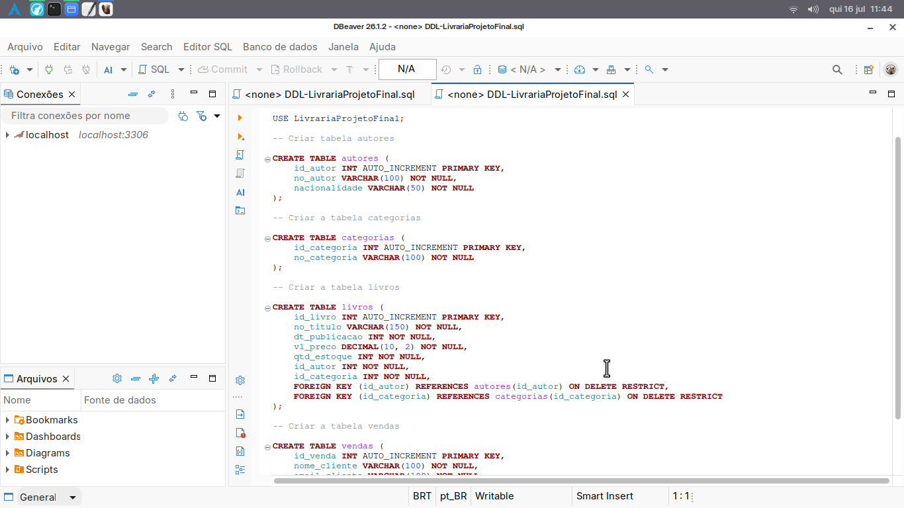

## Projeto: BiblioTech DBM

## Integrantes
Amanda, Ícaro e Luan

## Comandos Git Mais Utilizados
- git add .
- git commit -m ""  
- git pull  
- git push  

## Estrutura do Banco de Dados

**Banco de Dados:** `LivrariaProjetoFinal`  

Tabelas mapeadas a partir do arquivo [`DDL-ProjetoLivraria.sql`](DDL-ProjetoLivraria.sql).

### Tabela `autores`
Armazena o cadastro dos autores dos livros.

| Campo | Tipo | Restrições / Atributos | Descrição / Finalidade |
| :--- | :--- | :--- | :--- |
| `id_autor` | INT | PRIMARY KEY, AUTO_INCREMENT | Chave primária autoincrementada que identifica unicamente o autor. |
| `no_autor` | VARCHAR(100) | NOT NULL | Nome completo do autor. |
| `nacionalidade` | VARCHAR(50) | NOT NULL | País de origem ou nacionalidade do autor. |

### Tabela `categorias`
Armazena o cadastro de categorias/gêneros literários dos livros.

| Campo | Tipo | Restrições / Atributos | Descrição / Finalidade |
| :--- | :--- | :--- | :--- |
| `id_categoria` | INT | PRIMARY KEY, AUTO_INCREMENT | Chave primária autoincrementada que identifica unicamente a categoria. |
| `no_categoria` | VARCHAR(100) | NOT NULL | Nome da categoria (ex: Romance, Ficção Científica, Biografia). |

### Tabela `livros`
Armazena o acervo de livros disponíveis na livraria e suas informações de preço e estoque.

| Campo | Tipo | Restrições / Atributos | Descrição / Finalidade |
| :--- | :--- | :--- | :--- |
| `id_livro` | INT | PRIMARY KEY, AUTO_INCREMENT | Chave primária autoincrementada que identifica unicamente o livro. |
| `no_titulo` | VARCHAR(150) | NOT NULL | Título do livro. |
| `ano_publicacao` | INT | NOT NULL | Ano de publicação do livro em 4 dígitos. |
| `vl_preco` | DECIMAL(10, 2) | NOT NULL, CHECK (vl_preco >= 0) | Preço unitário de venda do livro. Deve ser um valor maior ou igual a 0,00. |
| `qtd_estoque` | INT | NOT NULL, CHECK (qtd_estoque >= 0) | Quantidade disponível do livro em estoque. Deve ser um valor maior ou igual a 0. |
| `id_autor` | INT | NOT NULL, FOREIGN KEY (autores) ON DELETE RESTRICT | Chave estrangeira que referencia o autor correspondente na tabela `autores`. |
| `id_categoria` | INT | NOT NULL, FOREIGN KEY (categorias) ON DELETE RESTRICT | Chave estrangeira que referencia a categoria correspondente na tabela `categorias`. |

### Tabela `vendas`
Registra as transações de venda de livros para clientes.

| Campo | Tipo | Restrições / Atributos | Descrição / Finalidade |
| :--- | :--- | :--- | :--- |
| `id_venda` | INT | PRIMARY KEY, AUTO_INCREMENT | Chave primária autoincrementada que identifica unicamente a venda. |
| `nome_cliente` | VARCHAR(100) | NOT NULL | Nome completo do cliente comprador. |
| `email_cliente` | VARCHAR(100) | NOT NULL | Endereço de e-mail do cliente comprador. |
| `id_livro` | INT | NOT NULL, FOREIGN KEY (livros) ON DELETE RESTRICT | Chave estrangeira que referencia o livro vendido na tabela `livros`. |
| `quantidade` | INT | NOT NULL, CHECK (quantidade > 0) | Quantidade de exemplares vendidos na transação. Deve ser maior que 0. |
| `data_venda` | DATE | NOT NULL | Data em que a venda foi efetuada. |
| `status_venda` | ENUM('finalizada', 'pendente', 'cancelada') | DEFAULT 'pendente' | Situação atual da venda (padrão é 'pendente'). |
